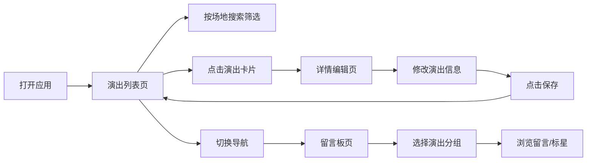

## 1. 产品概述

独立音乐人演出日程管理后台，用于管理和展示演出信息、编辑演出详情、收集和管理观众留言。目标用户为独立音乐人及其经纪团队，解决演出信息散乱、沟通效率低的问题。

## 2. 核心功能

### 2.1 功能模块

1. **演出列表页**：卡片式演出列表、按场地搜索筛选、状态标签展示、按时间倒序排列
2. **详情编辑页**：演出基本信息编辑、保存功能、表单验证、返回列表
3. **留言板页**：按演出分组留言、昵称内容时间展示、留言标星功能

### 2.3 页面详情

| 页面名称 | 模块名称 | 功能描述 |
|-----------|-------------|---------------------|
| 演出列表页 | 搜索框 | 输入场地关键词实时筛选演出 |
| 演出列表页 | 演出卡片 | 展示场地、日期、票价、状态标签，点击进入详情 |
| 演出列表页 | 导航栏 | 顶部导航，切换三个页面 |
| 详情编辑页 | 表单区域 | 编辑时间、地点、票价、备注等字段 |
| 详情编辑页 | 底部保存按钮 | 固定底部保存，带表单状态提示 |
| 留言板页 | 演出分组 | 下拉选择演出，展示对应留言 |
| 留言板页 | 留言卡片 | 昵称、内容、时间展示，星级切换按钮 |

## 3. 核心流程

用户打开应用 → 默认进入演出列表页 → 浏览或搜索演出 → 点击卡片进入详情编辑 → 修改信息后保存 → 切换到留言板 → 选择演出查看留言 → 对重要留言标星

## 4. 用户界面设计

### 4.1 设计风格

- **主色调**：深紫 #2D1B4E（背景、导航、卡片底色）
- **强调色**：亮橙 #FF6B35（按钮、标签、图标、选中态）
- **辅助色**：淡紫渐变、白色文本、浅灰次要文本
- **按钮风格**：圆角 12px，亮橙填充，悬停加深
- **卡片风格**：圆角 16px，深紫半透明背景，细微阴影
- **字体**：现代无衬线字体（Space Grotesk 或思源黑体），标题粗体大字号，正文常规
- **图标风格**：Lucide 线性图标，亮橙色

### 4.2 页面设计概览

| 页面名称 | 模块名称 | UI 元素 |
|-----------|-------------|-------------|
| 演出列表页 | 顶部导航 | 深紫背景、亮橙激活态、三标签切换 |
| 演出列表页 | 搜索框 | 圆角 12px、深紫输入框、亮橙搜索图标 |
| 演出列表页 | 演出卡片网格 | 响应式 1-3 列、圆角卡片、状态标签彩色徽章 |
| 详情编辑页 | 表单字段 | 圆角输入框、标签左对齐、输入时亮橙边框 |
| 详情编辑页 | 底部操作栏 | 固定底部、亮橙保存按钮、取消按钮 |
| 留言板页 | 分组选择 | 亮橙下拉选择器、当前演出高亮 |
| 留言板页 | 留言列表 | 时间倒序、星级图标点击切换颜色 |

### 4.3 响应式设计

- **桌面端**：三列卡片网格，侧边导航或顶部导航
- **平板端**：两列卡片网格
- **移动端**：单列卡片，汉堡菜单或底部标签导航，表单全宽输入
- **触摸优化**：按钮最小高度 44px，触摸反馈过渡动画
