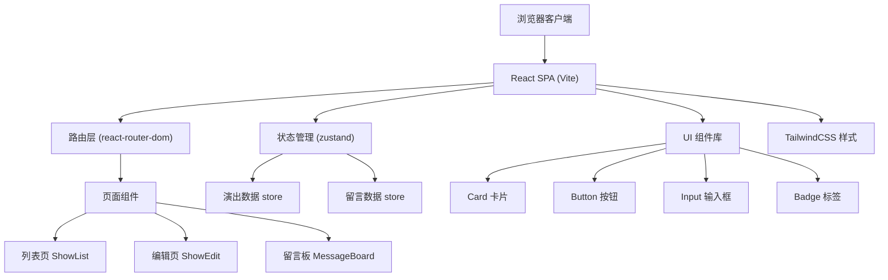

## 1. 架构设计



## 2. 技术描述

- **前端**：React 18 + TypeScript + Vite
- **路由**：react-router-dom 6
- **状态管理**：zustand（演出数据、留言数据、UI 状态）
- **样式方案**：TailwindCSS 3 + CSS Variables 主题
- **图标库**：lucide-react
- **数据持久化**：localStorage（模拟后端）
- **初始化工具**：vite-init
- **后端**：无（纯前端，使用 mock 数据 + localStorage）

## 3. 路由定义

| 路由 | 目的 |
|-------|---------|
| `/` | 重定向到 `/shows` |
| `/shows` | 演出列表页（默认页） |
| `/shows/:id` | 演出详情编辑页 |
| `/messages` | 留言板页 |

## 4. 数据模型

### 4.1 类型定义

```typescript
// 演出状态
type ShowStatus = 'upcoming' | 'ongoing' | 'completed' | 'cancelled';

// 演出数据
interface Show {
  id: string;
  venue: string;          // 场地
  date: string;           // 日期时间 ISO 字符串
  price: number;          // 票价（元）
  status: ShowStatus;     // 状态
  address: string;        // 详细地址
  notes: string;          // 备注
  createdAt: string;
  updatedAt: string;
}

// 留言数据
interface Message {
  id: string;
  showId: string;         // 关联演出 ID
  nickname: string;       // 昵称
  content: string;        // 留言内容
  createdAt: string;      // 留言时间
  starred: boolean;       // 是否标星
}
```

### 4.2 数据初始化

预置 5-8 条演出 mock 数据，每条演出配 2-5 条留言，确保页面有内容展示。
